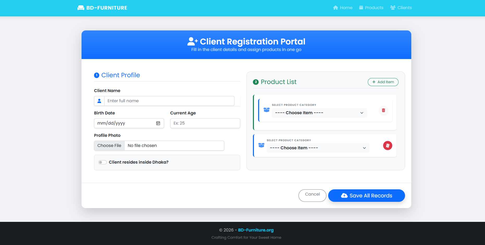

# Client Product Management System

This is an ASP.NET MVC web application for managing clients, products, and their orders.

## Features
- Add, edit, and delete clients
- Upload client images
- Add multiple products to a client (one-to-many relationship)
- Manage product list (CRUD operations)
- Display client orders with product details
- Clean and modern UI with Bootstrap

## Technologies Used
- ASP.NET MVC 5
- Entity Framework (Database First)
- SQL Server
- Bootstrap 5
- jQuery

## Modules
- Client Management
- Product Management
- Order Handling
  
 ## 📷 Screenshots

### Client List

  

  

  ### Product Page
 

   
 
 

### Create Client
 

## Functionality Highlights
- Dynamic product selection (Partial View)
- Image upload and storage
- One-to-many relationship (Client → Orders → Products)

## How to Run
1. Clone the repository
2. Open in Visual Studio
3. Restore NuGet packages
4. Configure database connection (Web.config)
5. Run the project

## Author
Mottaki Billah
